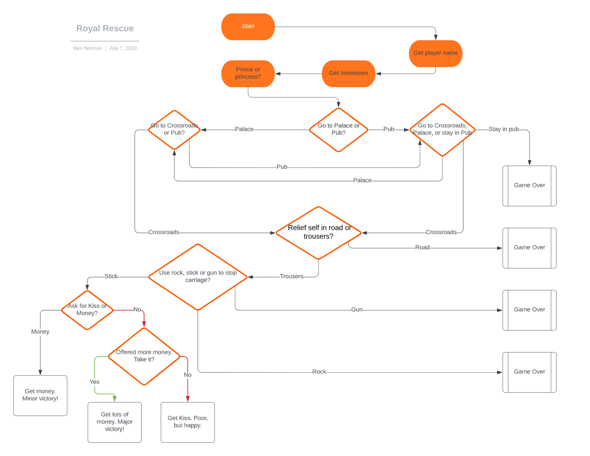
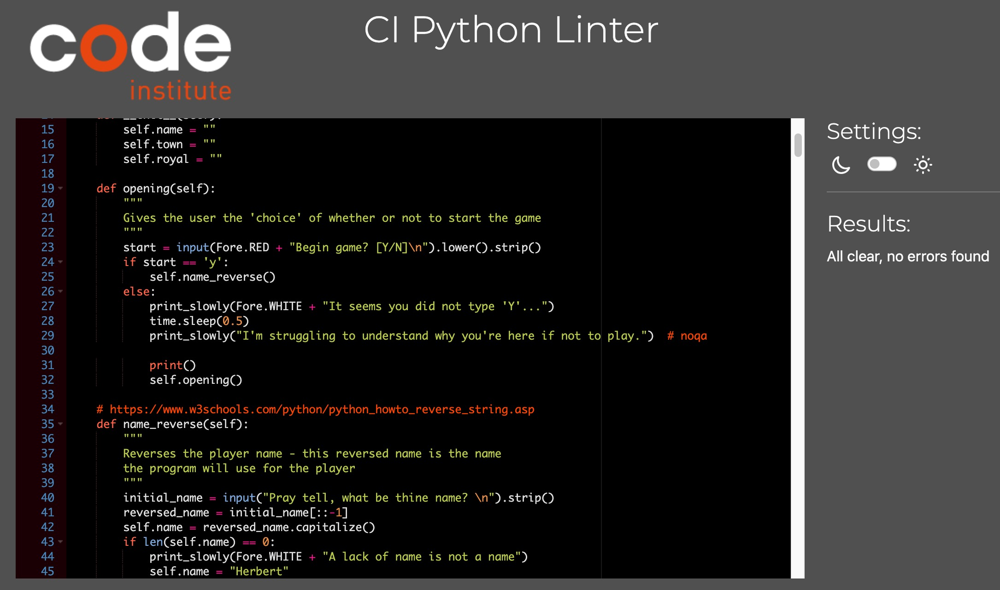
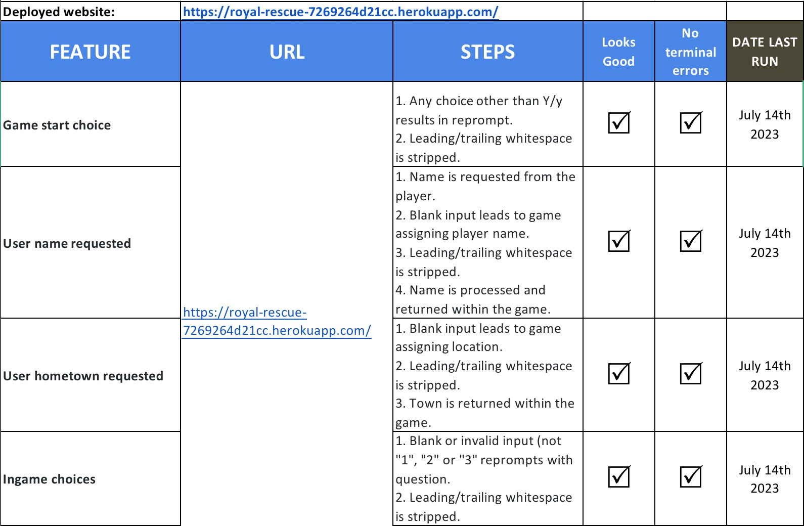
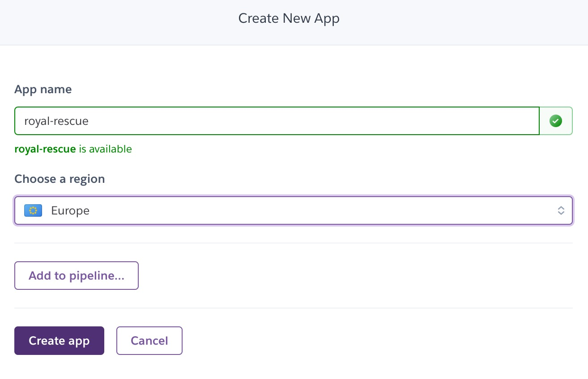
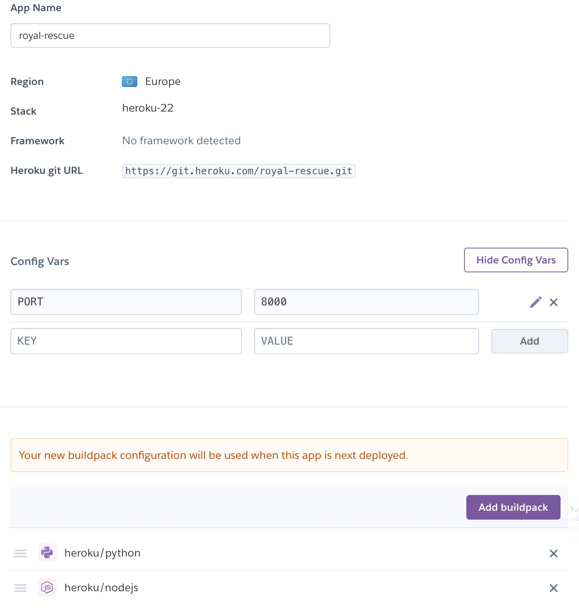
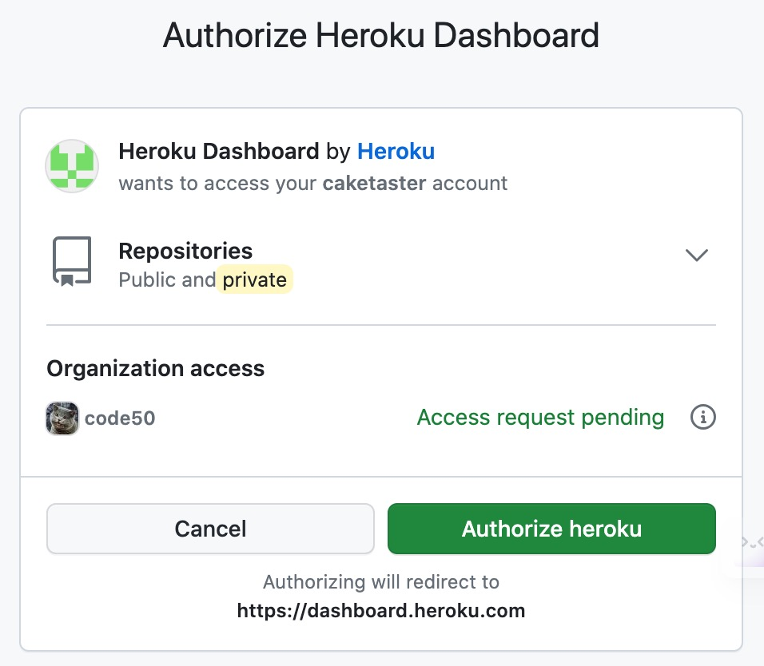
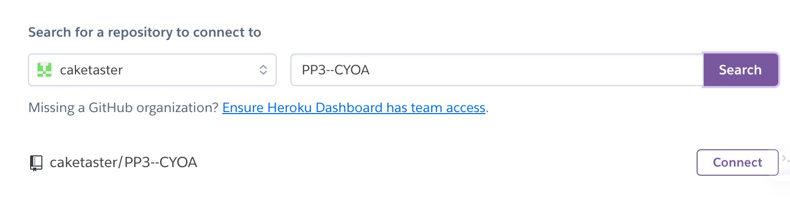
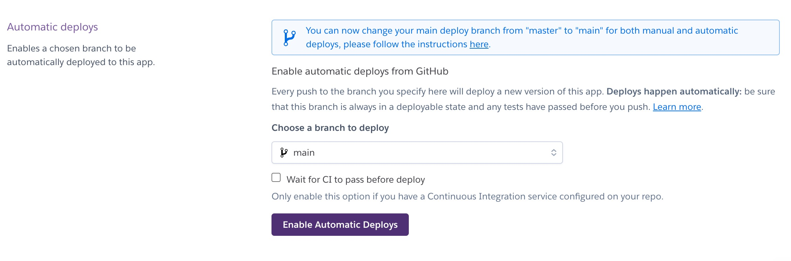

# Royal Rescue

This is my PP3 Python project, a Choose Your Own Adventure [CYOA] game where the player attempts to rescue a kidnapped prince or princess. The emphasis is on (quite poor) humour. There are 3 possible good endings and 4 bad endings. The player enters information which is used throughout the game and makes choices to try and rescue the royal. 

## Live site
[Live Site](https://royal-rescue-7269264d21cc.herokuapp.com/)

## Repository
[GitHub repository](https://github.com/caketaster/PP3--CYOA)

## Author 
Benjamin Norman

# Table of Contents
- [Royal Rescue](#royal-rescue)
  * [Live site](#live-site)
  * [Repository](#repository)
  * [Author](#author)
- [Table of Contents](#table-of-contents)
- [How to Play](#how-to-play)
- [Features](#features)
  * [Future Features](#future-features)
- [Flow Chart](#flow-chart)
- [Classes](#classes)
  * [Libraries Used](#libraries-used)
- [Testing](#testing)
  * [Validation testing](#validation-testing)
  * [Manual Testing](#manual-testing)
  * [Outstanding Defects](#outstanding-defects)
- [Deployment](#deployment)
- [Credits](#credits)
  * [Content](#content)
  * [Media](#media)
  * [Acknowledgments](#acknowledgments)

<small><i><a href='http://ecotrust-canada.github.io/markdown-toc/'>Table of contents generated with markdown-toc</a></i></small>

# How to Play
The player is prompted for their name and hometown before entering the game proper. Given a series of choices, the player must navigate (predominently by choosing story paths via "1" or "2") to try and save a kidnapped prince or princess.

# Features
The player is prompted for their name, which is then reversed and capitalised to be used as the player name throughout the game. If no name is submitted the game chooses a name for the player.

The player is then asked for their hometown, which is used as the setting for the game. Again, if none is entered then the game chooses a setting. 

The player then decides if they are rescuing a prince or a princess. This choice reflects minor changes in a few areas of the game. 

The player then has to make choices to navigate through the game. There are several locations: palace, pub, crossroads, and choices at each location which define whether or not you succeed or end with a Game Over failure. 

At the Palace, the player can choose to go towards the Pub or the Crossroads.
At the Pub the player can turn towards the Palace, Crossroads, or stay in the Pub.
On the way to the Crossroads the player must decide whether to take a toilet break or continue on.
At the Crossroads the player must choose which implement to use to try and save the royal.
If the correct implement is chosen, the player must choose their reward: a kiss or some money.
If a kiss is chosen, more money is offered. The player must decide whether to accept the money or insist on the kiss. 

There are 4 Game Over endings.
The player can secure victory in 3 different ways depending on their choices. 

The included flowchart details each possible choice and ending.

Pyfiglet is used to add an ASCII title to the game.

Colorama is used to add some colour to the game, with the title in BLUE, inputs given in RED, Game Over messages in YELLOW and victories in GREEN.

Time is used to simulate the text being typed out (so it doesn't all appear in an immediate block of text) and is also used to create pauses between some lines. 

## Future Features
In future I would like to add more levels of choices as the game currently is not hugely deep.

I originally wanted to include an element of randomness (dice throws) with buffs or debuffs depending on which weapon a player had chosen, but discarded this idea for reasons of complexity and time. 

I would like to add more ASCII art to the game, as it's currently all text within the game itself. ASCII pictures would add to the visual element. 

# Flow Chart
I used LucidChart to create a flowchart of the game showing all instances of information collection (orange boxes), choices (in diamond-shaped boxes), Game Over endings (margined boxes) and victories (standard boxes).
There were minor changes in a few areas from this original plan, but the shape is still correct.

# Classes
I used one class in the game, with the game itself as the class. All methods use self and all parameters are also self. 

## Libraries Used
I used the following libraries and modules:
* Pyfiglet
* Time [sleep]
* Sys
* Colorama [Fore]

# Testing
## Validation testing
I pasted run.py into the [CI Python Linter](https://pep8ci.herokuapp.com/) and had one single error (E261) returned multiple times (E261 at least two spaces before inline comment). This refers to my use of # noqa. 
But when leaving 2 spaces before # noqa, a separate error is raised in the VS Code terminal stating that my line is too long - I have to only use 1 space for the terminal to accept the # noqa. For that reason I'm ignoring the linter's error messages. 

## Manual Testing

When prompted to start the game, any stripped input other than Y/y will re-prompt the player to start the game.

When asked for their name, a completely blank input will result in a name being assigned to the player.

The name input is also stripped of leading and trailing blank spaces before being processed.

When asked for their hometown, a blank input will result in a town being assigned to the game.

In the majority of further choices [generally a choice of "1“ or ”2“] blank spaces are stripped and any choice other than the prescribed "1", "2" or occasionally "3" will result in the question being reprompted. 

## Outstanding Defects
Many of my lines were well over 80 characters, and I used # noqa liberally. 
I saw no reason to break long pieces of text into short lines when they wrap perfectly well.

# Deployment
The app was deployed to Heroku using the following steps:

Create new app  

Add buildpacks and config VARS  

Connect Heroku to GitHub 

Authorise the connection 

Connect to the correct repository 

Enable automatic deploys from the repository 

# Credits
-Code Institute Template - The Template for the GUI for this project was provided by Code Institute. This allows for the Command line to be shown and used within the browser.

## Content
I didn't copy text from any other site, the text was entirely my own.

## Media
I used no external media in my program.

## Acknowledgments
I used the following sites to assist in creating the game:  

Use of 'time' for pauses between sentences: 
[Writing a Text-Based Adventure Game in Python](https://www.youtube.com/watch?v=miuHrP2O7Jw&t=91s&ab_channel=DougMcNally)

To have the words 'type-out' rather than just appear in a block of text: 
[Simple Python Project _ Text-Based Adventure Game_ Time Unraveled](https://www.youtube.com/watch?v=ypNFNr72Xe8&t=229s&ab_channel=CompSciCentral)

The ASCII Art title: 
[Pyfiglet Python ASCII Art - Geeks For Geeks](https://www.geeksforgeeks.org/python-ascii-art-using-pyfiglet-module/#)

Creating a reverse-string: 
[How to Reverse String - W3 Schools](https://www.w3schools.com/python/python_howto_reverse_string.asp)

Using colours in Python: 
[Print Colors in the Python Terminal - Geeks For Geeks](https://www.geeksforgeeks.org/print-colors-python-terminal/)

And I couldn't have completed the program with help from my mentor, Malia. 