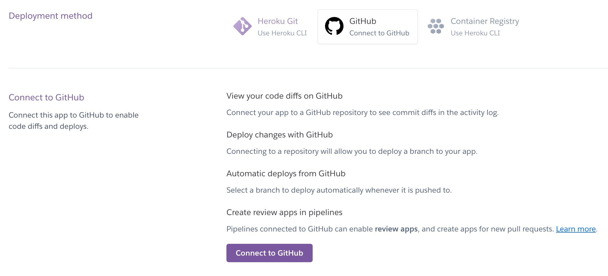

Welcome caketaster,

This is the Code Institute student template for deploying your third portfolio project, the Python command-line project. The last update to this file was: **August 17, 2021**

## Reminders

* Your code must be placed in the `run.py` file
* Your dependencies must be placed in the `requirements.txt` file
* Do not edit any of the other files or your code may not deploy properly

## Creating the Heroku app

When you create the app, you will need to add two buildpacks from the _Settings_ tab. The ordering is as follows:

1. `heroku/python`
2. `heroku/nodejs`

You must then create a _Config Var_ called `PORT`. Set this to `8000`

If you have credentials, such as in the Love Sandwiches project, you must create another _Config Var_ called `CREDS` and paste the JSON into the value field.

Connect your GitHub repository and deploy as normal.

## Constraints

The deployment terminal is set to 80 columns by 24 rows. That means that each line of text needs to be 80 characters or less otherwise it will be wrapped onto a second line.

-----
Happy coding!

# Royal Rescue

This is my PP3 Python project, a Choose Your Own Adventure [CYOA] game where the player attempts to rescue a kidnapped prince or princess. The emphasis is on (quite poor) humour. There are 3 possible good endings and 4 bad endings. The player enters information which is used throughout the game and makes choices to try and rescue the royal.

## Live site
* link to live site

## Repository
https://github.com/caketaster/PP3--CYOA

## Author 
Benjamin Norman

# Table of Contents
(use generator https://ecotrust-canada.github.io/markdown-toc/)

# How to Play
The player is prompted for their name and hometown before entering the game proper. Given a series of choices, the player must navigate (predominently by choosing story paths via "1" or "2") to try and save a kidnapped prince or princess.

# Features
The player is prompted for their name, which is then reversed and capitalised to be used as the player name throughout the game. If no name is submitted the game chooses a name for the player.

The player is then asked for their hometown, which is used as the setting for the game. Again, if none is entered then the game chooses a setting. 

The player then decides if they are rescuing a prince or a princess. This choice reflects in a few areas of the game. 

The player then has to make choices to navigate through the game. There are several locations: palace, pub, crossroads, and choices at each location which define whether or not you succeed or end with a Game Over failure. There are 4 Game Over endings.

In the final section the player can secure victory in 3 different ways depending on their choices. 

The included flowchart details each possible choice and ending.

Colorama is used to add some colour to the game, with inputs being in red, victories in green and Game Over endings in yellow.

Time is used to simulate the text being typed out (so it doesn't all appear in an immediate block of text) and there are pauses between some lines. 

## Future Features
Game expansion, colours, funky fonts etc
In future I would like to add more levels of choices as the game currently is not hugely deep.

I originally wanted to include an element of randomness (dice throws) with buffs or debuffs depending on which weapon a player had chosen, but discarded this idea for reasons of complexity and time. 

I would like to add more ASCII art to the game, as it's currently only text. ASCII pictures would add to the visual element. 

## Flow Chart
I used LucidChart to create a flowchart of the game showing all instances of information collection (orange boxes), choices (in diamond-shaped boxes), Game Over endings (margined boxes) and victories (standard boxes)

# Classes
see readme from Malia

## Libraries Used
time, colorama etc

# Testing

# Validation testing
For each python file in your project, paste it into CI's pep8 tool, and take a screenshot of the linter output showing NO ERRORS
https://pep8ci.herokuapp.com/
Note any errors or warnings you are ignoring and why.

# Manual Testing
Use Markdown to track how you tested each bit of user input for each valid option, various invalid entries and leading/trailing spaces

Feature 1

 invalid entry, says sorry and re-prompts
 no entry, says sorry and re-prompts
 alpha when numeric expected, sorry and re-prompts
 valid entry with leading spaces, trimmed and shows proper next stage
 valid entry with trailing spaces, trimmed and shows proper next stage
You should also call out how you tested any other features such as:

Welcome Message, recaps username
Score update shows current score
color change for correct vs incorrect

If you prefer spreadsheets, create a google-sheet and link to it in this section, just make sure you update the permissions to allow anyone to view it. You can make a COPY of this example and update it as your own. Just make sure you share it to anyone with the link: https://docs.google.com/spreadsheets/d/1w_JUmFfzHVtXdHse6ib82BGnRMPlPqufSOnAVN3bVl8/edit?usp=sharing

## Defect Tracking

Try to create issues in real time as it better reflects the daily life of a developer.

The easiest way to track defects is by using GITHUB's Issues to track these as it's really easy to copy/paste screenshots in and then write up how you closed them. At this stage you don't need a custom template or labels, that comes in P4.

## Outstanding Defects

It's ok to not resolve all the defects you found as long as:

it does not impact a user from completing a vital function on the website
it only affects a very small subset of users
is an extreme edge case that very few users would try
there is an open issue against a framework, browser or technology used
If you know of something that isn't quite right, create an issue and link to it here and explain why you chose not to resolve it.

Sometimes it's as simple, word wrapping issue that makes the site look odd at a certain screensize that you just didn't have time to fix due to the impending deadline it's best to mention it but note why you allowed it to go live: "Yes it looks odd, but it doesn't impact core functionality of the site." than to let the accessors think you didn't notice it.

## Commenting Code

Make sure you use triple double quotes to document functions and classes. Here'a documentation worthy example:

def yes_no(question):
    """
    Function to ask a simple yes no question of the user.
    :param question: String displayed as the question
    :return: answer: String equal to "1" or "2" representing yes or no respectfully
    """
    print(question)
    print("yes = 1")
    print("no = 2")
    answer = input("enter your answer here \n").strip()
    while answer not in ("1", "2"):
        print("please choose 1 for yes and 2 for no")
        answer = input("enter your answer here \n").strip()
    return answer

## Deployment

The app was deployed to Heroku using the following steps:

Create new app  

Add buildpacks and config VARS  

Connect Heroku to GitHub 

Authorise the connection 

Connect to the correct repository 

Enable automatic deploys from the repository 

# Credits

-Code Institute Template - The Template for the GUI for this project was provided by Code Institute. This allows for the Command line to be shown and used within the browser.

https://www.geeksforgeeks.org/print-colors-python-terminal/
https://www.w3schools.com/python/python_howto_reverse_string.asp

Content
🚨Required

Use bullet points to list out sites you copied text from and cross-reference where those show up on your site

Media
🚨Required

Make a list of sites you used images from. If you used several sites try to match up each image to the correct site. This includes attribution for icons if they came from font awesome or other sites, give them credit.

Acknowledgments
🚨Required

This is the section where you refer to code examples, mentors, blogs, stack overflow answers and videos that helped you accomplish your end project. Even if it's an idea that you updated you should note the site and why it was important to your completed project.

If you used a CodeInstitute Instructional project as a starting point. Make note of that here too.