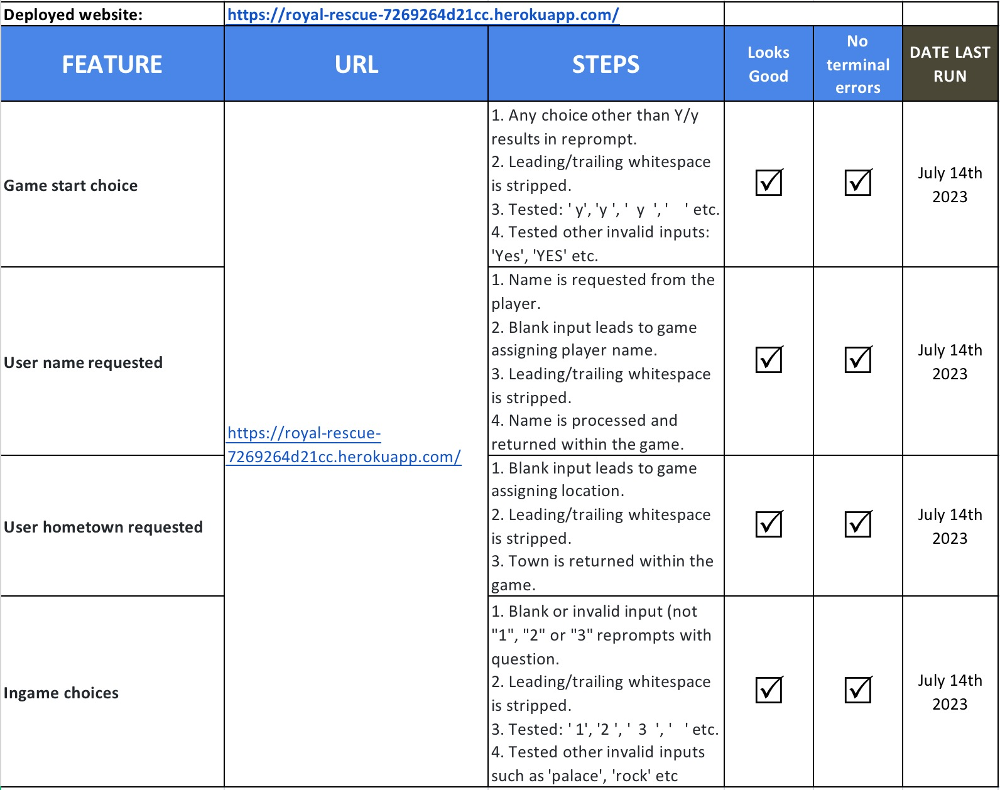

# Royal Rescue

This is my PP3 Python project, a Choose Your Own Adventure [CYOA] game where the player attempts to rescue a kidnapped prince or princess. The emphasis is on (quite poor) humour. There are 3 possible good endings and 4 bad endings. The player enters information which is used throughout the game and makes choices to try and rescue the royal. 

## Live site
[Live Site](https://royal-rescue-7269264d21cc.herokuapp.com/)

## Repository
[GitHub repository](https://github.com/caketaster/PP3--CYOA)

## Author 
Benjamin Norman

# Table of Contents
- [Royal Rescue](#royal-rescue)
  * [Live site](#live-site)
  * [Repository](#repository)
  * [Author](#author)
- [Table of Contents](#table-of-contents)
- [How to Play](#how-to-play)
- [Features](#features)
  * [Future Features](#future-features)
- [Flow Chart](#flow-chart)
- [Classes](#classes)
  * [Libraries Used](#libraries-used)
- [Testing](#testing)
  * [Validation testing](#validation-testing)
  * [Manual Testing](#manual-testing)
  * [Outstanding Defects](#outstanding-defects)
- [Deployment](#deployment)
- [Credits](#credits)
  * [Content](#content)
  * [Media](#media)
  * [Acknowledgments](#acknowledgments)

<small><i><a href='http://ecotrust-canada.github.io/markdown-toc/'>Table of contents generated with markdown-toc</a></i></small>

# How to Play
The player is prompted for their name and hometown before entering the game proper. Given a series of choices, the player must navigate (predominently by choosing story paths via "1" or "2") to try and save a kidnapped prince or princess.

# Features
Intro text  
 
The game is introduced with a retro-style bubble-font of the game title.

Name input: 
 
- The game collects the name.
- Name is reversed and capitalised to use as ingame-name.
- Blank name defaults to Herbert. 

Town input: 
 
- Game colects town as game location.
- Blank name defaults to Swindon. 

Prince or Princess: 
 
- Player chooses which type of royal needs rescuing.

Palace or Pub: 
 
- First directional choice.

Crossroads, Palace or Stay in Pub: 
 
- Choice of Palace, Crossroads, or staying in the Pub.

Relieve self in bushes or own clothes: 
 
- Choice of how to relieve oneself.

Choose rock, knife or stick: 
 
- Choice of implement to stop the carriage.

Choose money or kiss: 
 
- Choice of money or a kiss.

Choose more money or insist on kiss: 
 
- Choice of money or a kiss.

Generic features:
- For inputs, all leading/trailing whitespaces are stripped.
- Text 'types out' rather than appearing as an immediate block.
- There are pauses between some lines for dramatic effect.
- Input text does not type out, but appears immediately. Input text is in RED.
- Game Over text is in YELLOW.
- Victory text is in GREEN

- There are 4 Game Over endings.
- The player can secure victory in 3 different ways depending on their choices. 

The included flowchart details each possible choice and ending.

## Future Features
In future I would like to:
- add more levels of choices as the game currently is not hugely deep.
- add more ASCII art to the game, as it's currently all text within the game itself. ASCII pictures would add to the visual element. 
- include an element of randomness (dice throws) with buffs or debuffs depending on which weapon a player had chosen.
- put the dialogue into a spreadsheet so that the dialogue could be edited without going into the code. The game 'shape' could then be used with multiple different dialogue options.

# Flow Chart
I used LucidChart to create a flowchart of the game showing all instances of information collection (orange boxes), choices (in diamond-shaped boxes), Game Over endings (margined boxes) and victories (standard boxes).
There were minor changes in a few areas from this original plan, but the shape is still correct.

# Classes
I used one class in the game, with the game itself as the data model that tracks the parameters. All methods use self and all parameters are also self. All decisions are methods to the AdventureGame class.

## Libraries Used
I used the following libraries and modules:
* Pyfiglet
* Time [sleep]
* Sys
* Colorama [Fore]

# Testing
## Validation testing
I pasted run.py into the [CI Python Linter](https://pep8ci.herokuapp.com/) and zero errors were returned.

## Manual Testing

- When prompted to start the game, any stripped input other than Y/y will re-prompt the player to start the game.
- When asked for their name, a completely blank input will result in a name being assigned to the player.
- The name input is also stripped of leading and trailing blank spaces before being processed.
- When asked for their hometown, a blank input will result in a town being assigned to the game.
- In the majority of further choices [generally a choice of "1“ or ”2“] blank spaces are stripped and any choice other than the prescribed "1", "2" or occasionally "3" will result in the question being reprompted. 

## Outstanding Defects
Many of my lines were well over 80 characters, and I used # noqa liberally. 
I saw no reason to break long pieces of text into short lines when they wrap perfectly well in VS Code.
I acknowledge that another way would be to manually wrap long lines in triple quotes.

# Deployment
The app was deployed to Heroku using the following steps:

Create new app  

Add buildpacks and config VARS  

Connect Heroku to GitHub 

Authorise the connection 

Connect to the correct repository 

Enable automatic deploys from the repository 

# Credits
-Code Institute Template - The Template for the GUI for this project was provided by Code Institute. This allows for the Command line to be shown and used within the browser.

## Content
I didn't copy text from any other site, the text was entirely my own.

## Media
I used no external media in my program.

## Acknowledgments
I used the following sites to assist in creating the game:  

Use of 'time' for pauses between sentences: 
[Writing a Text-Based Adventure Game in Python](https://www.youtube.com/watch?v=miuHrP2O7Jw&t=91s&ab_channel=DougMcNally)

To have the words 'type-out' rather than just appear in a block of text: 
[Simple Python Project _ Text-Based Adventure Game_ Time Unraveled](https://www.youtube.com/watch?v=ypNFNr72Xe8&t=229s&ab_channel=CompSciCentral)

The ASCII Art title: 
[Pyfiglet Python ASCII Art - Geeks For Geeks](https://www.geeksforgeeks.org/python-ascii-art-using-pyfiglet-module/#)

Creating a reverse-string: 
[How to Reverse String - W3 Schools](https://www.w3schools.com/python/python_howto_reverse_string.asp)

Using colours in Python: 
[Print Colors in the Python Terminal - Geeks For Geeks](https://www.geeksforgeeks.org/print-colors-python-terminal/)

And I absolutely couldn't have completed the program with help from my mentor, Malia. 